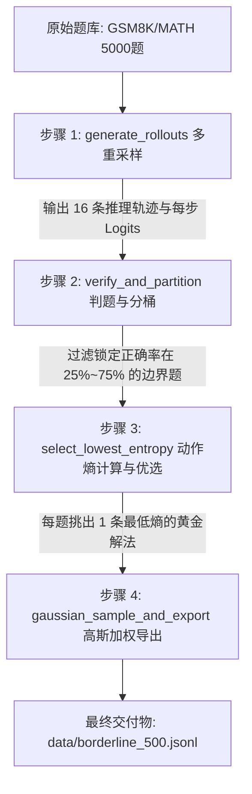
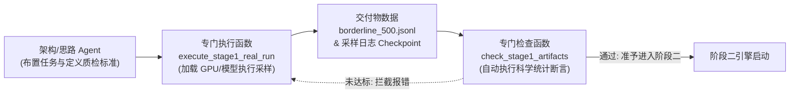
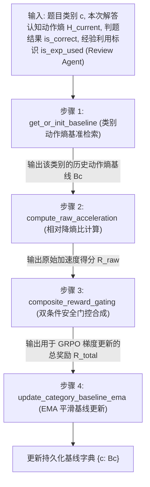
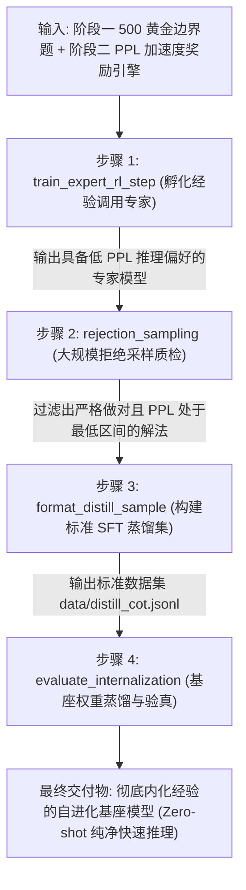

# 算法与系统模块推导详解 (System & Algorithm Explanations)

> **文档定位**：本文档专门用于系统化记录各个阶段的**具体算法步骤、底层原理、函数输入输出与代码流转逻辑**。按照“输入是什么 $\rightarrow$ 底层原理 $\rightarrow$ 调用哪个函数 $\rightarrow$ 产出传给下一步”的连续逻辑呈现，方便后续查阅、温习与指导代码实现。

---

## 目录
- [模块一：【阶段一】边界题挖掘与轨迹熵评估器](#模块一阶段一边界题挖掘与轨迹熵评估器)
- [模块二：【阶段二】加速度奖励与自适应基线引擎](#模块二阶段二加速度奖励与自适应基线引擎)
- [模块三：【阶段三】经验调用专家孵化与思维链合成数据蒸馏（DeepSeek-R1 范式）](#模块三阶段三经验调用专家孵化与思维链合成数据蒸馏deepseek-r1-范式)

---

## 模块一：【阶段一】边界题挖掘与轨迹熵评估器

### 1. 核心任务目标
从大规模无标注公开题库（如 GSM8K / MATH 5,000 题）中，通过模型自主采样和科学筛选，全自动抽取出最能激发模型发生认知跃迁的 **500 道黄金边界题**，并为每道题配准唯一一条“动作熵最低（逻辑最坚定清晰）的正确解答”。

### 2. 端到端数据流转图



---

### 3. 四步递进执行详解

#### 步骤 1：多重推理采样 (`generate_rollouts`)
- **输入数据**：
  - 题目文本字符串 `prompt`（如：*"已知 $x^2 - 5x + 6 = 0$，求 $x$ 的解"*）；
  - 基座模型 `model`（如 `Qwen2.5-Math-1.5B` 或 `7B`）与分词器 `tokenizer`。
- **底层原理**：
  单次做题存在巨大的偶然性（碰巧蒙对不代表掌握，卡壳一次不代表不会）。必须在带一定探索性的温度（Temperature = 0.7）下，让模型独立尝试多重采样（固定为 $K=16$ 次），观察其在解空间里的统计胜率与思维发散程度。
- **调用函数与伪代码**：
  ```python
  rollouts, logits_list = generate_rollouts(
      model=base_model,
      tokenizer=tokenizer,
      prompt=prompt,
      k_samples=16,       # 独立生成 16 次
      temperature=0.7,    # 开启适度发散探索
      max_new_tokens=1024
  )
  ```
- **输出传递**：
  输出 16 条完整的回答文本列表 `[o_1, o_2, ..., o_16]` 及其每步的 Token 概率分布张量，传递给**步骤 2**。

---

#### 步骤 2：答案可验证判题与难度分桶 (`verify_and_partition`)
- **输入数据**：
  - 步骤 1 产出的 16 条回答文本；
  - 题目对应的官方标准答案 `ground_truth`（如 `"{2, 3}"`）。
- **底层原理**：
  按照强化学习可验证奖励（RLVR）范式自动核对对错：
  - 全对（$\text{Acc} = 1.0$）：题目太简单，重训无增益，丢入 `Retired Set`（退休池）；
  - 全错或极难（$\text{Acc} < 0.25$）：模型完全不理解，强行学只会学到瞎猜逻辑，丢入 `Hard Set`；
  - **中等难度（$0.25 \le \text{Acc} \le 0.75$）**：**命中黄金边界题！** 此时模型处于“稍微使劲就能突破”的认知临界区。
- **调用函数与伪代码**：
  ```python
  verifications = [math_verify(extract_answer(r), ground_truth) for r in rollouts]
  acc = sum(verifications) / len(verifications)  # 16 次中做对的比例

  if 0.25 <= acc <= 0.75:
      bucket = "Borderline" # 锁定候选！
  ```
- **输出传递**：
  若命中边界题，提取这道题中所有答对的轨迹集合 `correct_rollouts`（如 16 条里答对的 8 条），传递给**步骤 3**。

---

#### 步骤 3：动作熵计算与低熵轨迹筛选 (`select_lowest_entropy`)
- **输入数据**：
  - 步骤 2 挑出的 8 条答对轨迹及其对应的预测概率分布 `correct_logits`。
- **底层原理**：
  同样是答案算对了，思考质量天差地别：
  - **高动作熵轨迹**：Token 分布平坦犹豫，说明是东拉西扯后碰巧猜对，属于“侥幸蒙对”，回放此类经验会污染策略（雪崩效应）；
  - **低动作熵轨迹**：Token 分布高度集中锐利，说明推导坚定、逻辑环环相扣，代表真正高质量的推理范式。
  - **目标**：用动作熵打分，在所有答对的解法中挑出动作熵最低的那 **1 条**。
- **数学公式与伪代码**：
  $$H(o) = -\frac{1}{|o|} \sum_{t=1}^{|o|} \sum_{v \in \text{TopP}(\mathcal{V})} \pi(v \mid q, o_{<t}) \cdot \log \pi(v \mid q, o_{<t})$$
  ```python
  def compute_trajectory_entropy(logits, top_p=0.95):
      probs = torch.softmax(logits, dim=-1)
      # 采用 Top-P 截断计算动作熵，节省 99% 显存
      token_entropy = -torch.sum(probs * torch.log(probs + 1e-10), dim=-1)
      return torch.mean(token_entropy).item()

  best_trajectory = min(correct_rollouts, key=lambda o: compute_trajectory_entropy(o.logits))
  ```
- **输出传递**：
  为这道边界题锁定了**唯一 1 条最优低熵解法**，推入全局边界题候选池，传递给**步骤 4**。

---

#### 步骤 4：高斯加权采样与最终数据集导出 (`gaussian_sample_and_export`)
- **输入数据**：
  - 全局边界题候选池（通常累积有 1,000~1,500 道带最佳解的边界题）；
  - 目标样本数：$N=500$。
- **底层原理**：
  在 $25\% \sim 75\%$ 之间，正中间 $\text{Acc} \approx 50\%$（16 次中刚好做对 8 次左右）的临界题优化梯度最大。因此以 $\mu=0.5$ 为中心用高斯钟形概率加权抽签，保证选出的 500 题高度聚焦在认知临界区。
- **数学公式与伪代码**：
  $$w_i = \exp\left( -\frac{(\text{Acc}_i - 0.5)^2}{2 \times 1.0^2} \right)$$
  ```python
  weights = [math.exp(-((item['accuracy'] - 0.5) ** 2) / 2.0) for item in candidate_pool]
  final_500_samples = weighted_sample_without_replacement(candidate_pool, weights, k=500)
  export_to_jsonl(final_500_samples, "data/borderline_500.jsonl")
  ```
- **最终交付物数据格式**：
  ```json
  {
    "id": "gsm8k_0042",
    "question": "小明有 5 个苹果...",
    "ground_truth": "15",
    "accuracy": 0.5,
    "best_trajectory": "首先计算...最后得到 \\boxed{15}",
    "entropy": 0.0714,
    "baseline_token_length": 348
  }
  ```

---

### 4. 阶段一落地任务流与【执行/检查函数】协同规范

为了保证算法与工程真正有效落地，阶段一代码编写完成后，通过解耦的“执行函数”与“检查函数”完成实验任务：



1. **执行函数 (`execute_stage1_real_run`)**：
   - **职责**：只管“跑批产出”。负责调度 GPU 硬件，挂载 `Qwen2.5-Math-1.5B`，调用流水线 `Stage1Pipeline` 完成 $K=8 \sim 16$ 采样并导出结果文件。
2. **检查函数 (`check_stage1_artifacts`)**：
   - **职责**：只管“独立质检与假设验真”。不依赖任何训练环境，对产出的 JSONL 数据进行 3 项自动化硬核查：
     - ① **分桶真实性**：确认是否挖掘出了准确率在 $[0.25, 0.75]$ 之间的临界题；
     - ② **低动作熵假设验真**：统计做对题目的轨迹动作熵均值是否显著低于做错题目（$\bar{H}_{\text{correct}} < \bar{H}_{\text{wrong}}$）；
     - ③ **字段纯净度**：确认无 NaN、无脏字符、格式完全符合契约。

---

## 模块二：【阶段二】加速度奖励与自适应基线引擎

### 1. 核心任务目标
在强化学习训练过程中，实时监测模型生成的思考链（CoT）**认知动作熵 / 困惑度（Action Entropy / Perplexity）**。在保证答案完全做对且经验真实复用（Dual-Condition Gating）的前提下，**奖励认知动作熵大幅削减、推导确定性显著提升的推理行为**，压制犹豫不决与无意义发散；同时自适应更新各类别的历史认知动作熵基准线 $B_c$。

### 2. 端到端数据流转图



---

### 3. 四步递进执行详解

#### 步骤 1：类别基准线检索与冷启动初始化 (`get_or_init_baseline`)
- **输入数据**：
  - 题目的分类标签 `category`（如 `"algebra"` 代数、`"geometry"` 几何）；
  - 系统维护的历史认知动作熵基线注册字典 `baseline_registry`（如 `{"algebra": 0.85, "geometry": 1.15}`）。
- **底层原理**：
  题目类型内在复杂度天然不同，各学科推理的不确定性与逻辑分支结构差异显著。**严禁使用全局统一步数或熵标尺**，系统放弃跟踪历史步数（800 Token），转而按题型细分类别独立维护认知动作熵 / 困惑度标尺 $B_c$。若冷启动无历史，则统一使用先验动作熵（默认赋初值 $1.0$ Nats）。
- **调用函数与伪代码**：
  ```python
  baseline_Bc = tracker.get_or_init_baseline(
      category="geometry", 
      default_prior=1.0
  )
  ```
- **输出传递**：
  获得该类别的当前认知动作熵标尺 $B_c$（如 1.0 Nats），传递给**步骤 2**。

---

#### 步骤 2：相对降熵比与标准化加速度奖励计算 (`compute_raw_acceleration`)
- **输入数据**：
  - 步骤 1 获取的历史动作熵基线 $B_c$（如 1.0 Nats）；
  - 模型本次解答实际采样的平均认知动作熵 $H_{\text{current}}$（如本次在经验加持下坚定推理，熵降至 0.60 Nats）。
- **底层原理**：
  计算**相对认知降熵幅度（Cognitive Entropy Reduction Acceleration Ratio）**：
  $$\Delta = \frac{B_c - H_{\text{current}}}{B_c}$$
  - **认知熵降低了（$H_{\text{current}} < B_c$）**：相对提速了 $\frac{1.0 - 0.60}{1.0} = 40\%$，原始加速度奖励值为 $+0.40$；
  - **认知熵未降低或升高（$H_{\text{current}} \ge B_c$）**：发生逻辑犹豫或无序发散，**硬截断为 0.0**（不奖也不施加摧毁性大负分）；
  - **物理下界保护与上限约束**：动作熵理论极值为 0.0 Nats（零不确定性状态，$\text{min\_guard} = 0.0$），奖励上限截断为 0.99；若 $B_c \le 0.0$ 或 $H_{\text{current}} < 0.0$ 则安全返回 0.0。
- **调用函数与伪代码**：
  ```python
  def compute_raw_acceleration(current_entropy, baseline_entropy, min_guard=0.0, max_accel=0.99):
      if baseline_entropy <= 0.0 or current_entropy < 0.0:
          return 0.0
      if current_entropy >= baseline_entropy:
          return 0.0
      raw_accel = (baseline_entropy - current_entropy) / baseline_entropy
      # 限制在 [0.0, max_accel] 之间，严禁负数破坏策略
      return max(0.0, min(raw_accel, max_accel))

  raw_accel_reward = compute_raw_acceleration(current_entropy=0.60, baseline_entropy=1.0)
  # 输出: 0.40
  ```
- **输出传递**：
  输出未受门控的原始降熵加速度得分 `raw_accel_reward = 0.40`，传递给**步骤 3**。

---

#### 步骤 3：双条件安全门控与复合奖励合成 (`composite_reward_gating`)
- **输入数据**：
  - 步骤 2 算出的 `raw_accel_reward = 0.40`；
  - 答案判定结果 `is_correct`（`True` 或 `False`）；
  - 外部审查智能体（Review Agent）语义审查结果 `is_exp_used`（`True` 或 `False`，默认 `True`）；
  - 加速度平衡权重 $\lambda$（推荐设为 $0.2$）。
- **底层原理（【全系统最核心的双条件防作弊闸门】）**：
  **防止模型偷懒走捷径与虚假提速（Reward Hacking & Experience Gating）**：
  如果答错也给加速度奖励，模型会走捷径输出极短瞎猜内容；同时，若模型在推理中并未实际有效复用先验经验条目（未依靠经验来降低认知熵），则绝不能发放加速分。
  因此构建**双条件联合安全门控（Dual-Condition Gate）**：
  **铁律：只有当答案完全正确（`is_correct == True`）且经 Review Agent 语义审查确认真实复用了经验（`is_exp_used == True`）时，加速度奖励才允许闭合放行！做错一票否决归零；做对但未复用经验仅获基础正确奖励 1.0，加速度奖励硬截断为 0.0！**
- **数学公式与伪代码**：
  $$\text{Gating} = \mathbb{I}(\text{is\_correct} \land \text{is\_exp\_used})$$
  $$R_{\text{total}} = R_{\text{correctness}} + \text{Gating} \cdot \lambda \cdot R_{\text{raw\_accel}}$$
  ```python
  def composite_reward_gating(is_correct, raw_accel, lambda_weight=0.2, is_exp_used=True):
      r_correct = 1.0 if is_correct else 0.0
      # 双条件联合闭合：答对 且 经 Review Agent 确认有效复用了经验
      gating = 1.0 if (is_correct and is_exp_used) else 0.0
      return r_correct + (gating * lambda_weight * raw_accel)

  # 场景 1（做对且用上经验降熵）：1.0 + 1.0 * 0.2 * 0.40 = 1.08
  total_reward = composite_reward_gating(is_correct=True, raw_accel=0.40, lambda_weight=0.2, is_exp_used=True)

  # 场景 2（做对但 Review Agent 判定未利用经验）：1.0 + 0.0 * 0.2 * 0.40 = 1.00
  total_reward_no_exp = composite_reward_gating(is_correct=True, raw_accel=0.40, lambda_weight=0.2, is_exp_used=False)

  # 场景 3（做错一票否决）：0.0 + 0.0 = 0.00
  total_reward_wrong = composite_reward_gating(is_correct=False, raw_accel=0.40, lambda_weight=0.2, is_exp_used=True)
  ```
- **输出传递**：
  输出总标量奖励 `total_reward = 1.08`（及其解构的 `RewardComponents`）交付给 GRPO 优化器进行梯度更新；同时将做对标记与有效动作熵传给**步骤 4**。

---

#### 步骤 4：动态基线指数移动平均（EMA）更新 (`update_category_baseline_ema`)
- **输入数据**：
  - 题目类别 `category`；
  - 本次做对的有效认知动作熵 $H_{\text{current}} = 0.60$；
  - 答案对错标识 `is_correct`；
  - 平滑衰减因子 $\alpha$（必须取高惯性保守值，如 $\alpha = 0.95$）；
  - 物理下界截断 `min_clamp = 0.0`（动作熵天然非负，物理极值设为 $0.0$ Nats）。
- **底层原理**：
  模型越来越成熟、推导越来越坚定，动作熵基准线 $B_c$ 必须跟进演进。但要防止**步步紧逼死锁（Moving Target Collapse）**：
  - 只有做对且有效的轨迹才能参与动作熵基线更新（答错或未利用经验的样本绝不污染基线）；
  - 更新必须极其平缓（EMA，旧基线占 95%），避免偶然一次超低动作熵推导让基线骤降，导致后续正常解题被误判为“犹豫发散”而陷入策略死锁；
  - 施加物理下界截断 $\text{min\_clamp} = 0.0$ Nats，守住动作熵理论边界（不再使用旧版 150 Token 限制）。
- **数学公式与伪代码**：
  $$B_c^{(t)} = \alpha B_c^{(t-1)} + (1 - \alpha) H_{\text{current}}$$
  ```python
  def update_category_baseline_ema(tracker, category, current_entropy, is_correct, alpha=0.95, min_clamp=0.0):
      if not is_correct:
          return  # 答错绝不更新基线
      
      old_b = tracker.registry.get(category, 1.0)
      new_b = alpha * old_b + (1.0 - alpha) * float(current_entropy)
      tracker.registry[category] = max(float(min_clamp), new_b)
  ```
- **输出结果**：
  基线从 1.0 Nats 平稳微调为 $0.95 \times 1.0 + 0.05 \times 0.60 = 0.98\ \text{Nats}$，持久化保存至注册表，用于下一次同类题目的评估。

---

## 模块三：【阶段三】经验调用专家孵化与思维链合成数据蒸馏（DeepSeek-R1 范式）

### 1. 核心任务目标
全面摈弃外挂式 RAG 查表或魔改底层 Transformer 硬件算子的老路，学习 DeepSeek-R1 正统技术路线：
1. 用【GRPO + PPL 加速度奖励】在 500 道黄金边界题上微调孵化出一个熟练的 **“经验调用专家模型（Expert Model）”**；
2. 让专家在大题库上自主展开解题，通过**拒绝采样（Rejection Sampling）**严格质检（严格答对 + 困惑度 PPL < 阈值），筛选出低 PPL、直击要害的高质量合成思维链；
3. 将高质量合成数据通过 SFT 蒸馏回原始基座模型，**将经验调用的思考本能彻底内化进神经网络权重（部署时纯 Zero-Shot，无外部记忆库依赖）**。

### 2. 端到端数据流转图



---

### 3. 四步递进执行详解

#### 步骤 1：经验调用专家强化孵化 (`train_expert_rl_step`)
- **输入数据**：
  - 初始基座模型（如 `Qwen2.5-Math-1.5B`）；
  - 阶段一产出的 500 道黄金边界题 `data/borderline_500.jsonl`；
  - 阶段二封装的 PPL 加速度与安全门控奖励引擎 `src/rewards/`。
- **底层原理**：
  边界题是模型能力跃升的临界区。通过 GRPO 组内相对优势学习，配合复合奖励：
  $$R_{\text{total}} = R_{\text{correctness}} + \mathbb{I}(\text{is\_correct}) \cdot \lambda \cdot R_{\text{accel(PPL)}}$$
  迫使模型在面对挑战时，自发倾向于调用高确定性的推理模式，大幅降低推导困惑度（PPL），迅速演化为“经验调用专家”。
- **调用函数与伪代码**：
  ```python
  def train_expert_rl_step(model, prompt_batch, reward_engine, group_size=4):
      # 每题采样 4 条轨迹
      rollouts, logits = generate_group_rollouts(model, prompt_batch, group_size=group_size)
      # 计算每条轨迹的复合奖励 (做对 1.0 + PPL 降幅奖励)
      rewards = [reward_engine.compute_total_reward(r) for r in rollouts]
      advantages = compute_group_relative_advantages(rewards)
      # 计算 GRPO 策略梯度损失并反向传播
      loss = compute_grpo_loss(logits, advantages)
      loss.backward()
      optimizer.step()
      return loss.item()
  ```
- **输出传递**：
  微调后的经验调用专家权重保存至 `models/expert_model/`，传递给**步骤 2**。

---

#### 步骤 2：专家大规模自主探索与双重拒绝采样质检 (`rejection_sampling`)
- **输入数据**：
  - 步骤 1 训练出的专家模型；
  - 扩展题库（如 GSM8K 扩充 1,000~2,000 题）；
  - 序列困惑度截断阈值 `ppl_cutoff`（或前 30% 分位数）。
- **底层原理**：
  仅凭最终答案正确很容易混入试错打转后猜对的冗长低质轨迹。必须实施**双重严格质检门禁**：
  - **门禁 1（答案正确性）**：严格数学等价校验，做错一律淘汰；
  - **门禁 2（认知流畅度 PPL）**：只保留推导自然流畅、困惑度极低的思维链（$\text{PPL} \le \text{cutoff}$）；
  - **优选**：若单题有多条合格轨迹，唯一下标选取 PPL 最低（逻辑最严密精炼）的那 1 条。
- **调用函数与伪代码**：
  ```python
  def rejection_sampling(expert_model, question, ground_truth, k_candidates=4, ppl_cutoff=2.5):
      candidates = expert_model.generate(question, num_return_sequences=k_candidates)
      valid = []
      for c in candidates:
          if math_verify(extract_answer(c.text), ground_truth):
              ppl = compute_sequence_ppl(c.logits, c.tokens)
              if ppl <= ppl_cutoff:
                  valid.append((c, ppl))
      if not valid:
          return None
      # 挑出 PPL 最低（最果断清晰）的唯一黄金解
      best_candidate, best_ppl = min(valid, key=lambda x: x[1])
      return best_candidate
  ```
- **输出传递**：
  输出清洗筛选后的高质量黄金思维链集合，传递给**步骤 3**。

---

#### 步骤 3：构建标准 SFT 蒸馏数据集 (`format_distill_sample`)
- **输入数据**：
  - 步骤 2 质检通过的高质量 `(question, best_candidate)` 样本对。
- **底层原理**：
  将专家的思维模式格式化为标准的问答蒸馏样本。在微调计算交叉熵损失（Cross Entropy Loss）时，通过设置 `labels` 将用户 Prompt 部分设为 `-100`（不计算梯度），仅对专家的 `<think>...</think>` 推理过程与最终答案部分计算监督梯度，确保基座模型只学习专家的推理技巧。
- **调用函数与伪代码**：
  ```python
  def format_distill_sample(question, trajectory):
      return {
          "messages": [
              {"role": "user", "content": question},
              {"role": "assistant", "content": f"<think>\n{trajectory.cot}\n</think>\n{trajectory.answer}"}
          ],
          "meta": {
              "ppl": trajectory.ppl,
              "source": "expert_distillation"
          }
      }
  ```
- **输出传递**：
  导出为标准的指令微调数据集 `data/distill_cot.jsonl`，传递给**步骤 4**。

---

#### 步骤 4：基座模型微蒸馏与 Zero-shot 权重内化验真 (`evaluate_internalization`)
- **输入数据**：
  - 原始初始基座模型 `raw_base_model`；
  - 步骤 3 导出的 `data/distill_cot.jsonl`；
  - 独立的留出测试集（如 GSM8K Test 100 题）。
- **底层原理（终极内化验证）**：
  - 拿蒸馏数据对原始基座微调（Micro-SFT 1~2 Epochs）；
  - **核心验真铁律**：测试时**严禁注入任何外部检索经验、严禁增加 Prompt 提示**，让蒸馏后的基座模型纯 Zero-shot 解题；
  - **内化成功判定**：
    1. 准确率 $\Delta \text{Acc} = \text{Acc}_{\text{distilled}} - \text{Acc}_{\text{raw}} > 0$；
    2. 推理困惑度 $\Delta \text{PPL} = \text{PPL}_{\text{raw}} - \text{PPL}_{\text{distilled}} > 0$；
    3. 实证证明：解题经验已完全固化在模型参数权重中，模型学会了自主快速果断推导！
- **调用函数与伪代码**：
  ```python
  def evaluate_internalization(distilled_model, raw_model, test_dataset):
      res_distill = run_zero_shot_eval(distilled_model, test_dataset)
      res_raw = run_zero_shot_eval(raw_model, test_dataset)
      
      gain = res_distill["acc"] - res_raw["acc"]
      ppl_drop = res_raw["mean_ppl"] - res_distill["mean_ppl"]
      return {
          "internalized": gain > 0.0 and ppl_drop > 0.0,
          "acc_gain": gain,
          "ppl_drop": ppl_drop
      }
  ```
- **最终交付物**：
  彻底内化经验的自进化基座模型，在 Zero-Shot 环境下展现出低困惑度、高准确率与快速推导质变。

