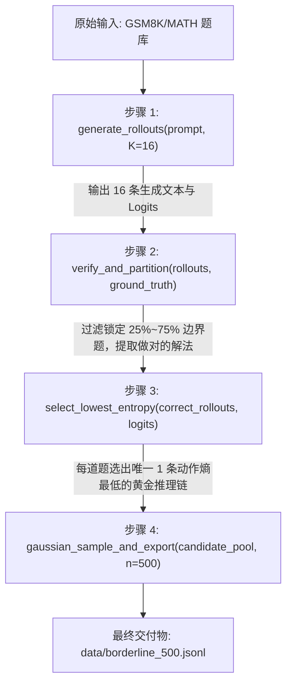

# 阶段一技术决策与流水线规范 (Decide - Stage 1)

> **定位说明**：本文档为【阶段一：边界题挖掘与轨迹熵评估器】的专项技术决策与实施规范。严格按照数据流动顺序，明确定义每一步的输入、底层原理、函数接口、输出传递与避坑标准，作为后续代码编写与单测验收的唯一权威依据。

---

## 📌 元数据与决策规则

- **决策编号**：`DEC-STAGE1-20260905`
- **决策/修改时间**：`2026-09-05 11:30:00 (UTC+8)`
- **涉及模块**：`src/evaluator/`（多重采样、答案核验、难度分桶、动作熵计算、高斯加权导出）
- **决策原因与依据 (Why)**：
  1. **杜绝黑盒混乱**：如果数据筛选逻辑不清晰，混入了过易（$100\%$）或过难（$0\%$）的题目，后期的强化学习将直接在噪音上空转；
  2. **杜绝侥幸轨迹污染**：仅凭答案对错无法保证思维链质量，必须通过严格的动作熵计算，剔除“碰巧做对”的高熵犹豫解，锁定真正具备方法论价值的高确定性思维链；
  3. **明确函数流转契约**：将整个阶段严格规整为 4 个串行函数，使单元测试（Unit Test）能够逐个函数做确定性断言。

---

## 🔄 阶段一端到端数据流动总览



---

## 📑 四步递进执行标准 (Sequential Pipeline Specification)

### 步骤 1：多重推理采样 (`generate_rollouts`)

1. **输入参数**：
   - `prompt`: 题目文本字符串（包含问题描述）；
   - `model`: 待评估基座模型（如 `Qwen2.5-Math-1.5B` 或 `7B`）；
   - `tokenizer`: 分词器；
   - `k_samples`: 独立采样次数，**强制固定为 $K=16$**（低于 8 次会导致方差过大）；
   - `temperature`: 采样温度，推荐设为 $0.7$（激发多样性探索）；
   - `max_new_tokens`: 最大生成长度，设为 $1024$ 或 $2048$。

2. **底层原理**：
   单次解题无法反映模型的真实能力边界。通过在相同 Prompt 下进行 16 次受控随机采样，获得模型在该题目上的解空间统计样本，用于后续计算经验正确率和思维稳定性。

3. **函数接口与伪代码定义**：
   ```python
   def generate_rollouts(
       model,
       tokenizer,
       prompt: str,
       k_samples: int = 16,
       temperature: float = 0.7,
       max_new_tokens: int = 1024
   ) -> tuple[list[str], list[torch.Tensor]]:
       """
       Returns:
           rollouts: 16条生成的回答文本列表 [o_1, o_2, ..., o_16]
           logits_list: 对应的生成每步的概率分布张量列表，每个形状为 [seq_len, vocab_size]
       """
   ```

4. **产出传递**：
   输出 16 条文本及其 Logits，完整打包传递给**步骤 2**。

---

### 步骤 2：答案抽取判题与难度分桶 (`verify_and_partition`)

1. **输入参数**：
   - `rollouts`: 步骤 1 产出的 16 条回答文本；
   - `ground_truth`: 数据集提供的标准答案真值（字符串）。

2. **底层原理**：
   按照可验证奖励（RLVR）范式自动化评估胜率：
   - 全对（$\text{Acc} = 1.0$）：进入 `Retired Set`（已彻底掌握，重训无增益，丢弃）；
   - 极难（$\text{Acc} < 0.25$）：进入 `Hard Set`（瞎猜居多，容易发散，丢弃）；
   - **中等难度（$0.25 \le \text{Acc} \le 0.75$）**：**命中黄金边界题！** 此时模型处于认知跃迁的关键临界区。

3. **函数接口与伪代码定义**：
   ```python
   def verify_and_partition(
       rollouts: list[str],
       ground_truth: str
   ) -> dict:
       """
       1. 提取每条回答中的 \boxed{...} 最终答案
       2. 使用 math-verify 规则判断与 ground_truth 是否数学等价
       3. 计算准确率并标记分桶
       """
       verifications = [math_verify(extract_answer(r), ground_truth) for r in rollouts]
       acc = sum(verifications) / len(verifications)
       
       if acc == 1.0:
           bucket = "Retired"
       elif acc < 0.25:
           bucket = "Hard"
       elif 0.25 <= acc <= 0.75:
           bucket = "Borderline"
       else:
           bucket = "Easy"
           
       return {
           "accuracy": acc,
           "bucket": bucket,
           "correct_indices": [i for i, v in enumerate(verifications) if v]
       }
   ```

4. **产出传递**：
   若判定不为 `Borderline`，则跳过该题；若为 `Borderline`，则将题目连同其答对的轨迹下标 `correct_indices` 传递给**步骤 3**。

---

### 步骤 3：动作熵计算与低熵轨迹筛选 (`select_lowest_entropy`)

1. **输入参数**：
   - 答对的轨迹集合 `correct_rollouts`（通常为 16 条中的 4~12 条）；
   - 对应的生成预测概率分布 `correct_logits`。

2. **底层原理**：
   同一道题即使都算对了，思考质量也有高下之分。
   - **高动作熵**：Token 分布平坦犹豫，表明模型是乱撞碰巧答对，存入会引发错误雪崩（Snowball Effect）；
   - **低动作熵**：Token 分布尖锐集中，表明逻辑严密确定，代表真正的高质量长思维链（CoT）。
   - **目标**：在所有答对的解答中，挑出整条链动作熵最低的那 **1 条**。

3. **数学公式与函数接口**：
   Token 级别动作熵公式：
   $$H(o) = -\frac{1}{|o|} \sum_{t=1}^{|o|} \sum_{v \in \text{TopP}(\mathcal{V})} \pi(v \mid q, o_{<t}) \cdot \log \pi(v \mid q, o_{<t})$$

   ```python
   def compute_trajectory_entropy(logits: torch.Tensor, top_p: float = 0.95) -> float:
       """
       计算单条轨迹在 Top-P 截断下的平均动作熵，极大降低全词表显存开销
       """
       probs = torch.softmax(logits, dim=-1)
       # 截断与归一化计算局部熵...
       token_entropies = -torch.sum(filtered_probs * torch.log(filtered_probs + 1e-10), dim=-1)
       return torch.mean(token_entropies).item()

   def select_lowest_entropy(correct_rollouts, correct_logits) -> tuple[str, float]:
       """
       遍历所有答对的回答，挑选出动作熵最小的最佳解法
       """
       scores = [compute_trajectory_entropy(l) for l in correct_logits]
       min_idx = int(torch.argmin(torch.tensor(scores)))
       return correct_rollouts[min_idx], scores[min_idx]
   ```

4. **产出传递**：
   将该边界题固化为结构化候选对象：`{question, ground_truth, accuracy, best_trajectory, trajectory_entropy, baseline_token_length}`，推入全局候选池，传给**步骤 4**。

---

### 步骤 4：高斯加权采样与最终数据集导出 (`gaussian_sample_and_export`)

1. **输入参数**：
   - 全局边界题候选池 `candidate_pool`（通常有 1,000~1,500 道）；
   - 目标筛选数量：**$N=500$**。

2. **底层原理**：
   在 $25\% \sim 75\%$ 区间内，最具突破价值的是处于最临界状态（$\text{Acc} \approx 50\%$，即 16 次中做对 8 次左右）的题目。因此使用中心在 $\mu=0.5$ 的高斯钟形概率进行无放回抽签，保证样本高度聚焦于认知临界区。

3. **数学公式与代码实现**：
   $$w_i = \exp\left( -\frac{(\text{Acc}_i - 0.5)^2}{2 \times 1.0^2} \right)$$
   ```python
   def gaussian_sample_and_export(
       candidate_pool: list[dict],
       n_samples: int = 500,
       output_path: str = "data/borderline_500.jsonl"
   ):
       weights = [math.exp(-((item['accuracy'] - 0.5) ** 2) / 2.0) for item in candidate_pool]
       # 按权重无放回抽选 500 题
       selected_samples = weighted_sample_without_replacement(candidate_pool, weights, k=n_samples)
       
       # 导出为 JSONL 文件
       with open(output_path, "w", encoding="utf-8") as f:
           for sample in selected_samples:
               f.write(json.dumps(sample, ensure_ascii=False) + "\n")
   ```

4. **最终交付物契约 (Data Schema)**：
   输出文件 `data/borderline_500.jsonl`，每行格式严格为：
   ```json
   {
     "id": "gsm8k_train_0381",
     "question": "小明有 5 个苹果...",
     "ground_truth": "15",
     "accuracy": 0.5,
     "best_trajectory": "思考过程：首先计算...最终结论：\\boxed{15}",
     "entropy": 0.0714,
     "token_length": 348
   }
   ```

---

## ⚠️ 阶段一防偏离红线 (Anti-Drift Guardrails)

1. **绝对禁止使用负对数似然 (NLL) 代替动作熵**：NLL 只反映单点概率，不反映分布平坦度，会导致低质轨迹混入；
2. **$K$ 采样次数严禁低于 8**：低于 8 会导致离散误差极大，产生虚假边界；
3. **答案抽取必须做格式归一化**：支持 LaTeX、分数（$1/2$ 与 $0.5$ 等价）、集合排序等数学等价性对比，杜绝因格式匹配失败而误杀正确答案。

---

## 🚀 阶段一后续落地任务发布与执行/检查契约 (Post-Stage 1 Task & Checker Protocol)

> **Agent 协同指引**：阶段一核心代码已开发测试完毕（81 项测试 100% 通过，无须返工修改）。作为架构规划与思路指导 Agent，在此正式发布 Stage 1 后的实操执行任务，并设立专门的**执行函数**与**检查函数**进行闭环质量验收。

### 任务卡 TASK-STAGE1-01：挂载真实模型进行微规模采样与边界验真

#### 1. 任务目标
利用已封装完毕的流水线，在本地单卡加载真实模型 `Qwen2.5-Math-1.5B` 对 GSM8K 样本题目进行多重采样，亲眼验证模型在真实数据上的难度分桶分布，并验证“正确解法的平均动作熵显著低于错误解法”的黄金科学假设。

#### 2. 专门执行函数规范 (`execute_stage1_real_run`)
- **执行脚本**：`pre1/scripts/run_stage1.py`
- **执行入口接口**：
  ```python
  def execute_stage1_real_run(
      model_path: str = "Qwen/Qwen2.5-Math-1.5B",
      dataset_path: str = "data/samples/gsm8k_sample.jsonl",
      k_samples: int = 8,
      temperature: float = 0.7,
      output_path: str = "data/borderline_500.jsonl",
      checkpoint_path: str = "data/checkpoint_stage1.jsonl",
      device: str = "auto"
  ) -> dict:
      """
      专门执行函数：负责调度底层 GPU 推理资源，加载真实模型权重，对题目进行真实采样、答案判题与低熵筛选。
      """
  ```
- **命令行调用示例**：
  ```bash
  python pre1/scripts/run_stage1.py --model_path Qwen/Qwen2.5-Math-1.5B --dataset pre1/data/samples/gsm8k_sample.jsonl --k_samples 8 --output pre1/data/borderline_real.jsonl
  ```

#### 3. 专门检查函数规范 (`check_stage1_artifacts`)
- **检查脚本**：`pre1/scripts/check_stage1.py`
- **检查入口接口**：
  ```python
  def check_stage1_artifacts(
      output_path: str,
      checkpoint_path: str | None = None,
      min_borderline_ratio: float = 0.10,
      assert_low_entropy_advantage: bool = True
  ) -> bool:
      """
      专门检查函数：独立审查执行产物的质量与统计学规律，包括：
      1. 契约 Schema 检验：每一行是否包含合法的 id, question, ground_truth, best_trajectory, entropy；
      2. 边界题准确率硬核验：检查导出的题目 accuracy 是否严格落在 [0.25, 0.75] 区间；
      3. 低动作熵假设断言：若提供了完整采样日志，检验做对轨迹动作熵均值是否显著低于做错轨迹；
      4. 纯净性保障：无 NaN、Inf、空文本或解析死循环。
      返回 True 表示验收通过，False 抛出审查异常并阻止后续阶段启动。
      """
  ```
- **命令行校验调用**：
  ```bash
  python pre1/scripts/check_stage1.py --artifact pre1/data/borderline_real.jsonl --checkpoint pre1/data/checkpoint_stage1.jsonl
  ```

