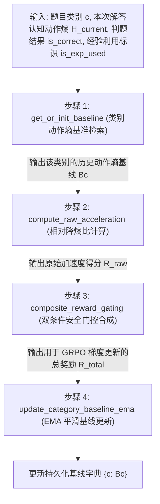

# 阶段二技术决策与流水线规范 (Decide - Stage 2)

> **定位说明**：本文档为【阶段二：加速度奖励与自适应基线引擎】的专项技术决策与实施规范。严格规定加速度奖励的计算标准、条件安全门控、EMA 动态演化算法与防偏离红线，作为后续代码编写与单元测试的唯一权威依据。

---

## 📌 元数据与决策规则

- **决策编号**：`DEC-STAGE2-20260905`
- **决策/修改时间**：`2026-09-05 13:45:00 (UTC+8) | 方案 A 重构修订: 2026-09-05 14:30:00 (UTC+8)`
- **涉及模块**：`src/rewards/`（类别动作熵基线管理、认知熵减加速度奖励计算、双条件安全门控复合、EMA 动态平滑）
- **决策原因与依据 (Why)**：
  1. **从步数压缩转向认知熵减提速（Scheme A: Cognitive Entropy Reduction）**：传统基于 Token 长度的压缩容易促使模型投机跳步或粗糙简化，并未触及逻辑确定性本质；转向以“认知动作熵 / 困惑度（Action Entropy / Perplexity）”为基准，激励模型借助经验坚决推导、实质性降低推理不确定性；
  2. **双条件门控与经验利用审计（Dual-Condition Experience Gating）**：速度奖励天然与正确性及经验复用博弈。必须通过严格的双条件门控（`is_correct == True` 且经外部审查智能体 Review Agent 判定 `is_exp_used == True`），彻底堵死瞎猜交卷与未复用经验却虚假套取奖励的漏洞；
  3. **防止基线骤降死锁与物理零界（Moving Target Collapse & Zero Clamp）**：采用保守高惯性的指数移动平均（EMA，$\alpha \ge 0.95$），并契合动作熵物理特性设置物理下界 $\text{min\_clamp} = 0.0$ Nats，确保基线演进平稳且永不死锁。

---

## 🔄 阶段二端到端数据流动总览



---

## 📑 四步递进执行标准 (Sequential Pipeline Specification)

### 步骤 1：类别基准线检索与冷启动初始化 (`get_or_init_baseline`)

1. **输入参数**：
   - `category`: 题目细分类别字符串（如 `"algebra"`、`"geometry"`、`"number_theory"`）；
   - `default_prior`: 冷启动默认先验认知动作熵（统一设为 $1.0$ Nats）。

2. **底层原理**：
   各学科内在复杂度与逻辑确定性天然不同，严禁使用全局单一基线。系统不再跟踪历史 Token 步数（如 800 Token），而是按题型细分类别独立维护认知动作熵 / 困惑度标尺 $B_c$。若冷启动无历史，则以先验值（默认 $1.0$ Nats）初始化。

3. **函数接口与伪代码**：
   ```python
   def get_or_init_baseline(
       tracker,
       category: str,
       default_prior: float = 1.0
   ) -> float:
       """
       从基线注册表中获取该类别的历史认知动作熵标尺 Bc，若不存在则使用先验值（默认 1.0 Nats）初始化
       """
       if category not in tracker.registry:
           tracker.registry[category] = float(default_prior)
       return tracker.registry[category]
   ```

4. **产出传递**：
   输出该类别的及格认知动作熵标尺 $B_c$（单位：Nats），传递给**步骤 2**。

---

### 步骤 2：相对降熵比与标准化加速度奖励计算 (`compute_raw_acceleration`)

1. **输入参数**：
   - `current_entropy`: 模型本次解答实际采样的平均认知动作熵 $H_{\text{current}}$；
   - `baseline_entropy`: 步骤 1 提供的历史动作熵基准线 $B_c$；
   - `min_guard`: 物理保护熵（预留参数，默认设为 $0.0$）；
   - `max_accel`: 提速比上限截断（默认设为 $0.99$）。

2. **底层原理与数学公式**：
   计算相对认知降熵幅度（Entropy Reduction Acceleration Ratio）：
   $$\Delta = \frac{B_c - H_{\text{current}}}{B_c}$$
   - **认知熵削减（$H_{\text{current}} < B_c$）**：说明逻辑推理更果断、困惑度显著降低，奖励线性映射到 $[0.0, \text{max\_accel}]$（最高截断为 $0.99$）；
   - **熵未降低或升高（$H_{\text{current}} \ge B_c$）**：推导发生犹豫或发散，硬截断为 $0.0$，严禁施加负分破坏模型基础策略；
   - **边界安全防护**：当 $B_c \le 0.0$ 或 $H_{\text{current}} < 0.0$ 时安全返回 $0.0$。

3. **函数接口与伪代码**：
   ```python
   def compute_raw_acceleration(
       current_entropy: float,
       baseline_entropy: float,
       min_guard: float = 0.0,
       max_accel: float = 0.99
   ) -> float:
       if baseline_entropy <= 0.0 or current_entropy < 0.0:
           return 0.0
       if current_entropy >= baseline_entropy:
           return 0.0
       # 计算相对降熵比例
       raw_accel = (baseline_entropy - current_entropy) / baseline_entropy
       # 约束在 [0.0, max_accel] 之间
       return max(0.0, min(raw_accel, max_accel))
   ```

4. **产出传递**：
   输出原始降熵加速度得分 `raw_accel`，传递给**步骤 3**。

---

### 步骤 3：双条件安全门控与复合奖励合成 (`composite_reward_gating`)

1. **输入参数**：
   - `is_correct`: 答案验证器给出的数学正确性布尔值（`True` 或 `False`）；
   - `raw_accel`: 步骤 2 计算出的原始降熵加速度得分；
   - `lambda_weight`: 加速度权重超参数（推荐 $0.1 \sim 0.3$，默认设为 $0.2$）；
   - `is_exp_used`: 外部审查智能体（Review Agent）基于语义判定的经验利用布尔值（`True` 或 `False`，默认 `True`）。

2. **底层原理与双条件经验门控 (Dual-Condition Gating)**：
   **核心红线与经验审计**：
   不仅需要防范“乱猜交卷”的伪提速，还必须防范“检索了先验经验却未实质性用于推导降熵”的骗分行为。
   因此，门控机制由单条件升级为**双条件联合门控（Dual-Condition Gate）**：
   $$\text{Gating} = \mathbb{I}(\text{is\_correct} \land \text{is\_exp\_used})$$
   $$R_{\text{total}} = R_{\text{correctness}} + \text{Gating} \cdot \lambda \cdot R_{\text{raw\_accel}}$$
   - **闭合条件**：必须同时满足答案正确（`is_correct == True`）**且**经 Review Agent 语义核验证明真正利用了经验降熵（`is_exp_used == True`），加速度奖励才被激活放行；
   - **一票否决**：若答错（`is_correct == False`），总奖励直接归零（$R_{\text{total}} = 0.0$）；若答对但未有效利用经验（`is_exp_used == False`），则仅获基础正确奖励（$R_{\text{total}} = 1.0$），加速度奖励硬截断为 $0.0$。

3. **函数接口与伪代码**：
   ```python
   def composite_reward_gating(
       is_correct: bool,
       raw_accel: float,
       lambda_weight: float = 0.2,
       is_exp_used: bool = True
   ) -> float:
       r_correct = 1.0 if is_correct else 0.0
       # 双条件联合闭合：答对 且 经 Review Agent 确认有效复用了经验
       gating = 1.0 if (is_correct and is_exp_used) else 0.0
       r_total = r_correct + (gating * lambda_weight * raw_accel)
       return r_total
   ```

4. **产出传递**：
   输出直接用于 GRPO 优势计算的总奖励值 $R_{\text{total}}$（及其解构出的 `RewardComponents`），并将有效熵值与做对信号传递给**步骤 4**。

---

### 步骤 4：动态基线指数移动平均（EMA）更新 (`update_category_baseline_ema`)

1. **输入参数**：
   - `category`: 题目类别；
   - `current_entropy`: 本次做对的有效认知动作熵 $H_{\text{current}}$；
   - `is_correct`: 判定结果；
   - `alpha`: EMA 平滑衰减因子（强制 $\alpha \ge 0.95$）；
   - `min_clamp`: 物理下限截断（动作熵天然非负，物理极值设为 $0.0$ Nats）。

2. **底层原理与数学公式**：
   $$B_c^{(t)} = \alpha B_c^{(t-1)} + (1 - \alpha) H_{\text{current}}$$
   - **条件更新**：只有做对的有效轨迹才参与动作熵基线平滑演进，错误或未用经验轨迹绝不能污染基线；
   - **高惯性收敛**：历史基线权重 $\ge 95\%$，新样本仅占至多 $5\%$ 权重，防止单次波动引发基线骤降策略死锁；
   - **物理零界截断**：动作熵的物理下界为 0.0 Nats（零不确定性状态），将物理下界参数 $\text{min\_clamp}$ 调整为 $0.0$，废止旧版 150 Token 步数限制。

3. **函数接口与伪代码**：
   ```python
   def update_category_baseline_ema(
       tracker,
       category: str,
       current_entropy: float,
       is_correct: bool,
       alpha: float = 0.95,
       min_clamp: float = 0.0
   ):
       if not is_correct:
           return  # 答错绝不更新基线标尺
       
       old_baseline = tracker.registry.get(category, 1.0)
       new_baseline = alpha * old_baseline + (1.0 - alpha) * float(current_entropy)
       # 施加物理下限钳位 (>= 0.0 Nats)
       tracker.registry[category] = max(float(min_clamp), new_baseline)
   ```

---

## ⚠️ 阶段二防偏离红线 (Anti-Drift Guardrails)

1. **红线一（双条件安全门控与做错一票否决）**：只要 `is_correct == False`，总奖励与加速度奖励强制归零；若未有效复用经验（`is_exp_used == False`），加速度奖励硬截断为 $0.0$；绝对禁止在错误推导或未利用经验时发放加速奖励；
2. **红线二（基线高惯性与物理零界截断）**：$\alpha$ 严禁低于 $0.90$（推荐 $0.95$），下界截断 $\text{min\_clamp} \ge 0.0$ Nats，防止基线骤降引发策略死锁；
3. **红线三（类别隔离维护）**：严禁抹平学科差异使用全局统一步数或动作熵标尺，必须严格按代数、几何等独立分类存储与演化各自的认知动作熵基线。

---

## 🚀 阶段二落地任务发布与执行/检查契约 (Post-Stage 2 Task & Checker Protocol)

> **Agent 协同指引**：阶段二算法核心已就绪。在此正式发布 Stage 2 真实模型奖励验算核验任务，设立专门的**执行函数**与**检查函数**进行独立准入核验。

### 任务卡 TASK-STAGE2-VERIFY：挂载真实模型进行单题奖励验算核验

#### 1. 任务目标
在启动 Stage 3 大闭环训练前，花约 30 秒在本地 GPU 上加载 `Qwen2.5-Math-1.5B`，对 1 道 GSM8K 题目多重采样 4 条轨迹，验证真实模型输出下：
1. 真实序列困惑度（PPL）数值处于正常物理区间（$1.0 \sim 10.0$）；
2. 答错解答严格被安全门控一票否决（$R_{\text{total}} = 0.0$）；
3. 答对解答依降阻比例正常发放加速度奖励；
4. EMA 认知基线平稳演化。

#### 2. 专门执行函数规范 (`execute_stage2_real_verify`)
- **执行脚本**：`pre2/scripts/verify_stage2_real.py`
- **调用方式**：
  ```bash
  python pre2/scripts/verify_stage2_real.py --model Qwen/Qwen2.5-Math-1.5B --k_samples 4
  ```

#### 3. 专门检查函数规范 (`check_stage2_verify_results`)
- **检查脚本**：`pre2/scripts/check_stage2_verify.py`
- **核验断言**：
  - 断言一：`status == "COMPLETED"` 且样本数 $\ge 1$；
  - 断言二：平均 PPL 处于健康区间 $[1.0, 50.0]$，杜绝 NaN/Inf 与除以零；
  - 断言三：做错样本的奖励严格为 $0.0$（守住红线一）；
  - 断言四：做对样本奖励 $\ge 1.0$，基线更新正常。
- **调用方式**：
  ```bash
  python pre2/scripts/check_stage2_verify.py
  ```

