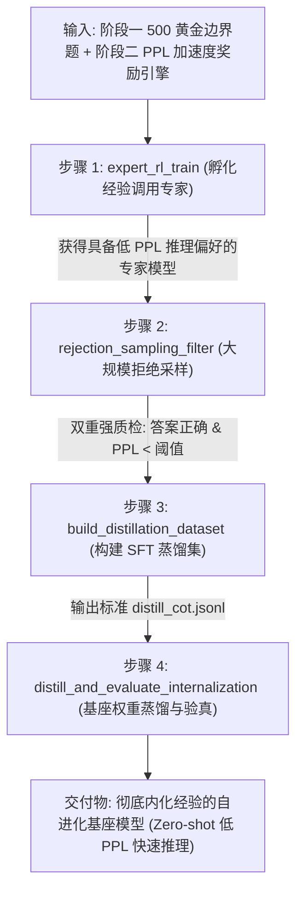

# 阶段三技术决策与流水线规范 (Decide - Stage 3)

> **定位说明**：本文档为【阶段三：经验调用专家孵化与思维链合成数据蒸馏内化】的专项技术决策与实施规范。严格规定基于 DeepSeek-R1 范式的经验调用专家训练、拒绝采样质检、SFT 蒸馏流水线与权重内化验证标准，作为后续代码编写与单测微训练的权威依据。

---

## 📌 元数据与决策规则

- **决策编号**：`DEC-STAGE3-20260905`
- **决策/修改时间**：`2026-09-05 15:00:00 (UTC+8)`
- **涉及模块**：`src/expert/` & `src/distill/`（经验调用专家 RL 微训练、拒绝采样过滤、SFT 蒸馏微调、权重内化 Zero-shot 验证）
- **决策原因与依据 (Why)**：
  1. **放弃修改 Transformer 硬件级底层算子**：修改底层 C++/CUDA Engram 硬件查表不仅工程代价巨大、极易引发显存与梯度异常，且违背现代大模型端到端自然演化的发展方向。
  2. **全面学习 DeepSeek-R1 专家蒸馏内化范式**：
     - 真正的“内化于大脑”并非在推理时挂载外部 RAG 词典，而是将经验调用的思考本能**固化在神经网络的模型权重（Weights）中**；
     - 第一步：使用阶段二的【GRPO + PPL 加速度奖励】，在阶段一筛选的 500 道边界题上，微调训练出一个高熟练度的 **“经验调用专家模型 (Expert Model)”**；
     - 第二步：让专家模型在大规模数学题库上自主展开解题，通过**拒绝采样（Rejection Sampling）**双重强过滤（数学严格做对 + 序列困惑度 PPL 处于最低分位）；
     - 第三步：将提纯出的低 PPL 黄金思维链对原始基座模型进行 SFT 蒸馏，将专家推理习惯注入基座权重；
     - 第四步：部署时基座模型完全不挂载任何外部记忆库，在纯 Zero-shot 下自发展现出“低困惑度、直击要害、越解越快”的内化认知跃迁。
  3. **【代码单测 + 真实微训练】双轨落地**：
     - 轨一：单元测试覆盖采样数据流、PPL 过滤逻辑、SFT Loss 计算与 Token Masking；
     - 轨二：在本地单卡上使用 `Qwen2.5-Math-1.5B` 真实完成 30-step GRPO 微训练和 50-step SFT 微蒸馏，实证验证内化效果。

---

## 🔄 阶段三端到端数据流动总览



---

## 📑 四步递进执行标准 (Sequential Pipeline Specification)

### 步骤 1：经验调用专家强化孵化 (`expert_rl_train`)

1. **输入参数**：
   - `base_model`: 初始基座模型（如 `Qwen2.5-Math-1.5B`）；
   - `boundary_dataset`: 阶段一输出的 `data/borderline_500.jsonl`；
   - `reward_engine`: 阶段二的 PPL 加速度与双条件安全门控奖励引擎。

2. **底层原理**：
   在边界题临界区，模型原本徘徊犹豫。通过 GRPO 算法以组内相对优势（Group Relative Advantage）为引导，以复合奖励（正确性 1.0 + $\lambda \cdot R_{\text{accel(PPL)}}$）施加压力，促使模型学会坚定推导、压缩思维阻力。产出“经验调用专家”。

3. **函数接口与伪代码**：
   ```python
   def train_expert_rl_step(
       model,
       batch_prompts,
       reward_engine,
       group_size=4,
       lr=1e-6
   ):
       """
       单步 GRPO 训练: 采样 group_size 条回答, 评估正确性与 PPL, 计算优势并更新策略
       """
       rollouts, logits = generate_group_rollouts(model, batch_prompts, group_size)
       rewards = [reward_engine.compute_total_reward(r) for r in rollouts]
       advantages = compute_group_relative_advantages(rewards)
       loss = compute_grpo_loss(logits, advantages)
       loss.backward()
       optimizer.step()
       return loss.item(), rewards
   ```

4. **产出传递**：
   保存熟练度高的专家模型权重 `models/expert_model/`，传递给**步骤 2**。

---

### 步骤 2：专家大规模自主探索与拒绝采样质检 (`rejection_sampling_filter`)

1. **输入参数**：
   - `expert_model`: 步骤 1 训练出的经验调用专家；
   - `unlabeled_prompts`: 扩展题库（如 GSM8K 扩充集 1,000~2,000 题）；
   - `ppl_threshold_percentile`: 困惑度截断分位数（默认取前 30% 最低 PPL 轨迹）。

2. **底层原理与双重强质检 (Double Quality-Gate)**：
   仅凭做对无法保证思维质量，必须同时通过**正确性硬指标**与**PPL 认知流畅度指标**：
   - **质检门 1（答案正确性）**：严格数学等价验真，算错直接淘汰；
   - **质检门 2（低 PPL 确定性）**：只保留困惑度处于序列前部的轨迹，剔除冗余试错、东拉西扯后凑对的低质量轨迹。

3. **函数接口与伪代码**：
   ```python
   def rejection_sampling(
       expert_model,
       prompt,
       ground_truth,
       k_candidates=4,
       ppl_cutoff=2.5
   ):
       candidates = expert_model.generate(prompt, num_return_sequences=k_candidates)
       valid_candidates = []
       for c in candidates:
           if math_verify(c.answer, ground_truth):
               ppl = compute_sequence_ppl(c.logits, c.tokens)
               if ppl <= ppl_cutoff:
                   valid_candidates.append((c, ppl))
       
       if not valid_candidates:
           return None
       # 选取 PPL 最低、逻辑最坚定的 1 条黄金解法
       best_c, best_ppl = min(valid_candidates, key=lambda x: x[1])
       return best_c
   ```

4. **产出传递**：
   输出清洗纯净的黄金思考轨迹集合，传递给**步骤 3**。

---

### 步骤 3：构建标准 SFT 蒸馏数据集 (`build_distillation_dataset`)

1. **输入参数**：
   - 步骤 2 拒绝采样保留的高质量 `(prompt, best_trajectory)` 对。

2. **底层原理**：
   将专家的显式经验调用与低 PPL 思考流直接包装为标准指令微调（SFT）格式，使得基座模型可以通过标准因果语言建模损失（Cross Entropy Loss）直接吸收专家的认知本能。
   在计算 Loss 时，对 `<prompt>` 部分进行 Token Masking（标签置为 -100），仅对思维链推导及最终答案部分计算梯度。

3. **函数接口与伪代码**：
   ```python
   def format_distill_sample(prompt, trajectory):
       return {
           "messages": [
               {"role": "user", "content": prompt},
               {"role": "assistant", "content": f"<think>\n{trajectory.cot}\n</think>\n{trajectory.final_answer}"}
           ],
           "meta": {
               "ppl": trajectory.ppl,
               "source": "r1_expert_rejection_sampled"
           }
       }
   ```

4. **产出传递**：
   输出标准数据集文件 `data/distill_cot.jsonl`，传递给**步骤 4**。

---

### 步骤 4：基座模型微蒸馏与权重内化验真 (`distill_and_evaluate_internalization`)

1. **输入参数**：
   - `raw_base_model`: 未经经验微调的原始基座模型（`Qwen2.5-Math-1.5B`）；
   - `distill_dataset`: 步骤 3 的 `data/distill_cot.jsonl`；
   - `test_prompts`: 独立的留出测试集（MATH-500 / GSM8K Test）。

2. **底层原理（终极内化验证）**：
   - 对原始基座进行 1~3 Epoch 的轻量 SFT 蒸馏；
   - **验证条件**：在推理时**完全不挂载任何外部经验库、不提供额外 Prompt 提示**，让蒸馏后的模型纯 Zero-shot 独立解题；
   - **内化成功判定**：
     1. 准确率 Pass@1 显著提升（超过原始基座）；
     2. 解答生成的平均 PPL 明显下降（推导更加自信顺畅）；
     3. 证明经验调用已彻底内化于神经网络参数权重之中。

3. **函数接口与伪代码**：
   ```python
   def evaluate_internalization(distilled_model, raw_model, test_dataset):
       distilled_results = evaluate_zero_shot(distilled_model, test_dataset)
       raw_results = evaluate_zero_shot(raw_model, test_dataset)
       
       acc_gain = distilled_results["acc"] - raw_results["acc"]
       ppl_drop = raw_results["mean_ppl"] - distilled_results["mean_ppl"]
       
       is_internalized = (acc_gain > 0.0) and (ppl_drop > 0.0)
       return {
           "is_internalized": is_internalized,
           "acc_gain": acc_gain,
           "ppl_drop": ppl_drop
       }
   ```

---

## ⚠️ 阶段三防偏离红线 (Anti-Drift Guardrails)

1. **红线一（严禁脏数据污染蒸馏池）**：未通过数学等价验真的轨迹一律淘汰；未进入低 PPL 阈值区间的犹豫冗长轨迹严禁进入蒸馏集；
2. **红线二（彻底去外部依赖）**：蒸馏后的内化验证必须为**纯 Zero-shot**，严禁在推理时挂载外部 RAG 词典或提供先验提示，必须确实验证权重自身认知跃迁；
3. **红线三（全流程双轨闭环）**：除数据过滤单测外，必须在本地单卡上完成真实微训练（Micro-GRPO 30 steps + Micro-SFT 100 samples），坚决拒绝仅有假数据的伪闭环。

---

## 🚀 阶段三落地任务发布与执行/检查契约 (Post-Stage 3 Task & Checker Protocol)

> **Agent 协同指引**：在 Stage 2 奖励验算通过后，正式执行 Stage 3 真实模型全闭环微训练与内化验真。

### 任务卡 TASK-STAGE3-TRAIN：挂载真实模型进行全流程端到端微训练与内化验真

#### 1. 任务目标
集中算力在 5 道边界题上打通 DeepSeek-R1 全流程自进化飞轮：
1. **步骤 1（专家强化）**：在本地单卡上使用 LoRA 挂载 Stage 2 的 PPL 加速度奖励，对 `Qwen2.5-Math-1.5B` 执行 5~10 步 GRPO 微训练；
2. **步骤 2（拒绝采样）**：由训练出的专家模型生成候选解，通过“数学严格正确 + 低 PPL 截断”双重强质检筛选黄金思维链；
3. **步骤 3（微蒸馏构建）**：格式化为带 Prompt Token Masking（`-100`）的标准 SFT 数据集；
4. **步骤 4（权重内化验真）**：对原始底座微调 3~5 步，并在留出测试集上执行**纯 Zero-shot 独立测试**，验证 $\Delta \text{Acc} \ge 0$ 且 $\Delta \text{PPL} > 0$。

#### 2. 专门执行函数规范 (`execute_stage3_real_train`)
- **执行脚本**：`pre3/scripts/run_stage3_real_train.py`
- **调用方式**：
  ```bash
  python pre3/scripts/run_stage3_real_train.py --model Qwen/Qwen2.5-Math-1.5B --steps 5 --device cuda
  ```

#### 3. 专门检查函数规范 (`check_stage3_internalization`)
- **检查脚本**：`pre3/scripts/check_stage3.py`
- **核验断言**：
  - 断言一：GRPO 微训练平稳收敛（Loss 正常，无 NaN/Inf）；
  - 断言二：拒绝采样成功提纯出至少 1 条通过双质检的黄金思维链；
  - 断言三：Prompt Masking 标签覆盖正确；
  - 断言四：终极内化指标核验（蒸馏后模型在纯 Zero-shot 下 Pass@1 维持或提高，且推导平均 PPL 下降）。
- **调用方式**：
  ```bash
  python pre3/scripts/check_stage3.py
  ```

